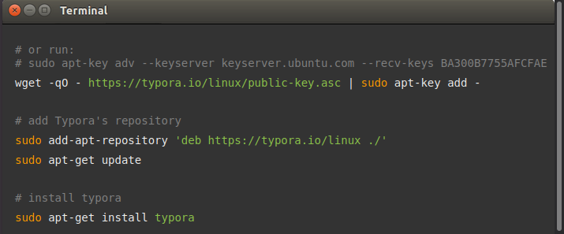
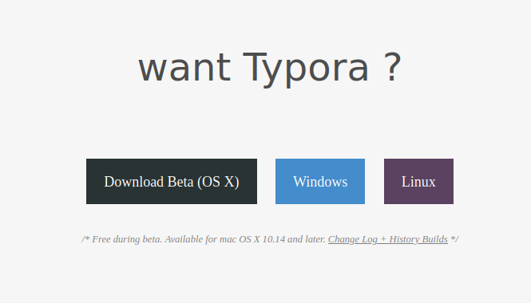
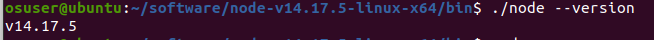
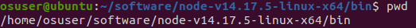
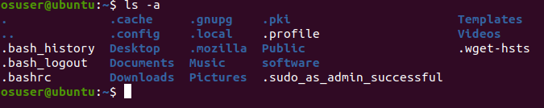

# 开源软件第二周

## 1.工具软件准备

### （1）安装typora

```
# sudo apt-key adv --keyserver keyserver.ubuntu.com --recv-keys BA300B7755AFCFAE
wget -qO - https://typora.io/linux/public-key.asc | sudo apt-key add -

# add Typora's repository
sudo add-apt-repository 'deb https://typora.io/linux ./'
sudo apt-get update

# install typora
sudo apt-get install typora
```

### （2）截屏快捷键

Pirnt Screen 为截屏键

＃保存到文件夹，主目录（home）下的图片文件夹中

Print Screen #截取整个桌面

Alt + Print Screen #截取选中的窗口

Shift + Print Screen #自由选区

 

＃剪贴板

Ctrl + Print Screen #整个桌面

Ctrl + Alt + Print Screen #选中的窗口

Shift + Ctrl +Fn + Print Screen #自由选区





### （3）安装chrome


### (4)安装vscode

为了开发过程中版本稳定，我们使用压缩包解压，配置路径方式;避免升级系统软件时改变版本号。

解压缩：tar -xxvf node-v14.17.5-linux-x64.xz

解压后，检查程序运行是否正常：进入程序目录，执行：



打印出node所在目录，将目录拷贝到剪切板：



/home/osuser/software/node-v14.17.5-linux-x64/bin

添加环境路经：编辑bashrc文件，将路经添加：



执行vim.bashrc:

在最后添加：PATH=/home/osuser/software/node-v14.17.5-linux-x64/bin:$PATH

执行.bashrc：. .bashrc或source .bashrc

执行后，只在当前终端有效；如果在所有终端有效，需要重启。 

如果没有vim，安装sudo apt install vim -y

